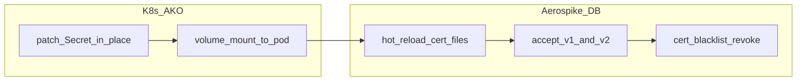

# Section 03 — Instructor notes

## Timing

| Lab | Instructor time | Notes |
|-----|-------------------|-------|
| 3.1 | 15–20 min | PKI generation only; cluster stays plain TCP |
| 3.2 | 20 min | Password auth over TLS — good stopping point |
| 3.3 | 30–40 min | Three phases; allow extra time for PKIOnly cutover |
| 3.4 | 20 min | Run workload in background before rotation |
| 3.5 | 25 min | Overlap + blacklist demo |

## Pitfalls

- **Lab 3.1 always uses `--full`** — clears Section 2 CR drift (operations, RF3, 8.1.2.x image).
- **`PKIOnly` is one-way** — migrate `app` and `exporter` before `admin`; confirm PKI login in a second terminal before removing admin password.
- **Service TLS only** — do not enable fabric/heartbeat TLS; intra-cluster traffic stays on 3001/3002.
- **Lab 2.5 on Karpenter** — blocklist path is eksctl-only; Section 3 has no such restriction.

## Certificate rotation

Who does what during Labs 3.4 and 3.5:

| Lab | AKO role | Aerospike role | Access preserved because |
|-----|----------|----------------|--------------------------|
| 3.4 | Mount + secret patch (`tls-server-secret`) | Hot reload server cert from disk | Same CA, same mount path, client PKI certs unchanged |
| 3.5 | Mount + secret patch; blacklist CR | Overlap accepts v1 and v2; `cert-blacklist` revokes v1 | v2 proven before v1 revoked; same CA and CN (`app`) |

Rotation pitfalls:

- **Do not rotate the CA in-place** without a migration plan — clients and server trust must move together.
- **Blacklist after overlap**, not before — revoking v1 before v2 is live locks out the `app` user.
- **Job restart ≠ auth outage** — `rotate-client-workload.sh` stops then starts the Job; TPS may dip briefly while PKI overlap keeps authentication available. Set this expectation in the classroom.

## Skip paths

- **Short workshop:** Stop after Lab 3.2 (encryption in transit only).
- **No Section 2:** Run 3.1 after 0.6; `prepare-lab.sh 3.1` full-resets to 8.1.0.0 baseline automatically.

## Artifacts

Generated PKI lives under `secrets/tls/` (gitignored). Kubernetes secrets: `tls-ca-secret`, `tls-server-secret`, `tls-client-*`, `tls-ako-client-secret`.
