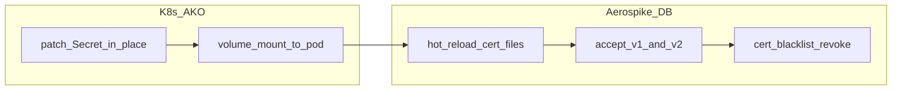

# Section 03 — Instructor notes

## Timing

| Lab | Instructor time | Notes |
|-----|-------------------|-------|
| 3.1 | 15–20 min | PKI generation only; cluster stays plain TCP |
| 3.2 | 20 min | Password auth over TLS — good stopping point |
| 3.3 | 30–40 min | Three phases; allow extra time for PKIOnly cutover |
| 3.4 | 20 min | Run workload in background before rotation |
| 3.5 | 25 min | Overlap + blacklist demo |

## Reading Section 3 commands

Each lab labels command blocks with **What / Credential / mode / Expect** (see [Section 03 README](README.md#how-to-read-commands)). Wrapper scripts echo the same facts to stdout — read script output alongside the lab guide.

- **Lab 3.4 vs 3.5:** server cert rotation replaces one server identity (new serial, same CN); client cert rotation keeps the same CN (`app`) with two valid serials during overlap until blacklist.
- **Lab 3.5 Step 3 is required** — do not skip the v1 overlap proof. Narrate: "two valid serials until blacklist." Run Step 5 (re-test v1) immediately after blacklist so trainees see the before/after contrast.

## Pitfalls

- **Lab 3.1 uses light reset** — redeploys the AerospikeCluster on 8.1.0.x without tearing down workload node pools (reuses Section 1/2 nodes). Pass `--full` only if you intentionally want to destroy and recreate nodegroups.
- **Lab 3.1 → 3.2 handoff** — trainees finish 3.1 with PKI secrets and a plain-TCP baseline, then deploy TLS in 3.2 (`deploy-cluster-tls-standard*.sh`). `prepare-lab.sh 3.2` is instructor recovery only (`RESET=skip` default: validate secrets + deploy + wait; no teardown).
- **Lab 3.2 stuck / ACLUpdateFailed** — if prepare-lab hangs after Helm deploy, check `kubectl -n aerospike get aerospikecluster aerocluster -o jsonpath='{.status.phase}'`. Phase `Error` with `ACLUpdateFailed` usually means operator TLS config is wrong: tls-standard needs `ca-file` in the server TLS stanza; `operatorClientCert` should use the **server cert** (`svc_chain.pem` from `tls-server-secret`) with `tlsClientName: aerocluster` (matching `tls-name`). Do not use `ako-operator` or a separate operator client cert here — that is for Lab 3.3+ mTLS. Aerospike logs may show `SSL alert bad certificate` when the wrong cert is presented.
- **Server cert must have a SAN, not just a CN** — `generate-workshop-pki.sh` signs `svc_chain.pem` with `subjectAltName = DNS:${TLS_CLUSTER_NAME}` (`aerocluster`). Go's `crypto/x509` (used by the AKO operator's embedded Aerospike client) has ignored CN-as-hostname since Go 1.15, so a CN-only server cert fails the operator's TLS handshake with a `bad certificate` alert and ACL reconcile never completes — even when `operatorClientCert`/`tlsClientName`/`ca-file` are otherwise correct. If PKI was regenerated manually (not via the script) and 3.2 is stuck, run `openssl x509 -in secrets/tls/svc_chain.pem -noout -text | grep -A1 "Subject Alternative Name"` to confirm the SAN is present; if missing, run `./scripts/setup/tls/generate-workshop-pki.sh --server-only && ./scripts/setup/tls/deploy-tls-secrets.sh` and redeploy.
- **`PKIOnly` is one-way** — migrate `app` and `exporter` before `admin`; confirm PKI login in a second terminal before removing admin password.
- **`PKIOnly` users must not set `secretName`** — AKO's admission webhook rejects `aerospikeAccessControl.users[]` entries that specify both `secretName` and `authMode: PKIOnly` (`user admin cannot set secretName when authMode is PKIOnly`). Identity comes from the client cert CN, not a password secret, so omit `secretName` entirely for PKIOnly users in the manifest/Helm values.
- **Service TLS only** — do not enable fabric/heartbeat TLS; intra-cluster traffic stays on 3001/3002.
- **Lab 2.5 on Karpenter** — blocklist path is eksctl-only; Section 3 has no such restriction.

## Certificate rotation

Who does what during Labs 3.4 and 3.5:

| Lab | AKO role | Aerospike role | Access preserved because |
|-----|----------|----------------|--------------------------|
| 3.4 | Mount + secret patch (`tls-server-secret`) | Hot reload server cert from disk | Same CA, same mount path, client PKI certs unchanged |
| 3.5 | Mount + secret patch; blacklist CR | Overlap accepts v1 and v2; `cert-blacklist` revokes v1 | v2 proven before v1 revoked; same CA and CN (`app`) |

Rotation pitfalls:

- **Do not rotate the CA in-place** without a migration plan — clients and server trust must move together.
- **Blacklist after overlap**, not before — revoking v1 before v2 is live locks out the `app` user.
- **Job restart ≠ auth outage** — `rotate-client-workload.sh` stops then starts the Job; TPS may dip briefly while PKI overlap keeps authentication available. Set this expectation in the classroom.
- **Secret data patch ≠ pod recreation** — patching Secret content in place does not trigger AKO reconcile; only **CR spec changes** do. See Lab 3.4 and 3.5 **Secret updates and pod recreation** sections.

### When Aerospike pods roll vs stay up

| Change | DB pods recreated? |
|--------|-------------------|
| Patch Secret data (`tls-server-secret`, `tls-client-app-secret`) — CR unchanged | **No** (kubelet updates mounts; Aerospike reloads or clients reconnect) |
| Change CR spec (TLS config, volumes, `authMode`, blacklist volume) | **Yes** — AKO rolling restart |
| Restart asbench Job (`rotate-client-workload.sh`) | **No** (DB pods unaffected; workload Job only) |

## Skip paths

- **Short workshop:** Stop after Lab 3.2 (encryption in transit only).
- **No Section 2:** Run 3.1 after 0.6; `prepare-lab.sh 3.1` light-resets to 8.1.0.0 baseline and ensures baseline nodes exist.

## Artifacts

Generated PKI lives under `secrets/tls/` (gitignored). See [secrets/README.md](../../secrets/README.md) for the TLS secret layout. Kubernetes secrets: `tls-ca-secret`, `tls-server-secret`, `tls-client-*`, `tls-ako-client-secret`.

Section scripts and manifests are linked from each lab guide under **Workshop artifacts**.
